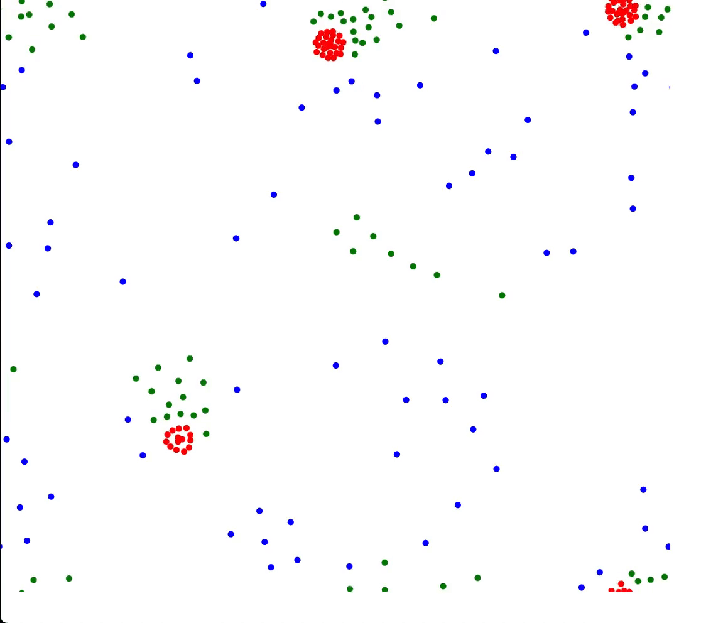

# Particles Game of Life

Game simulating "color" forces, inspired by Nuclear Physics.

Game made with: JavaScript and Canvas.

Based on youtube tutorials 🙂

- [How Particle Life emerges from simplicity](https://www.youtube.com/watch?v=p4YirERTVF0)
- [Artificial Particle Life - Simulation & Code](https://www.youtube.com/watch?v=0Kx4Y9TVMGg)

## Live Demo

https://DarthVanger.github.io/js-particles-game-of-life



## How to start

Clone the project

```
git clone https://github.com/DarthVanger/js-particles-game-of-life
```

Change dir to the project folder

```
cd js-particles-game-of-life
```

Start a server

```
npx http-server .
```
